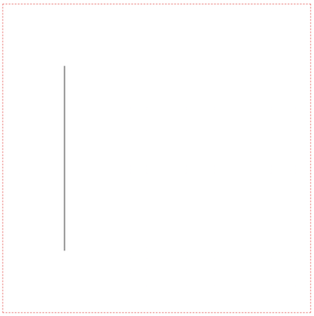
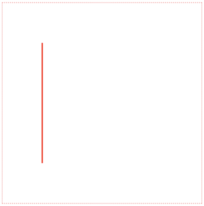
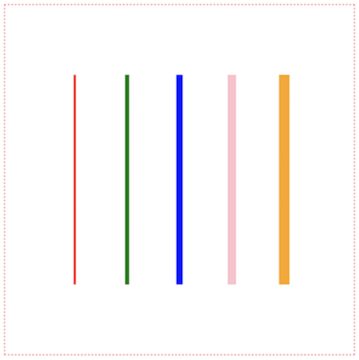

Hi everybody on our first lesson of the course "Canvas Basics Guide".

## Course overview

In that course, we’ll cover a lot of topics about ```canvas``` capability. It’s will be enough to make an animation or even to create a simple 2d game. We’ll consider drawing simple figures, simple animation, compare rerendering approach, and create sprite animation.

## Introduction

As I guess you’ve heard about canvas, it isn’t a new technology. Canvas is an ```HTML5``` element, that had created by Apple. It changes the way of creating reach interactive animation.

Before in that purpose was used ```Flash```. I remember this technology very well because I have experience in creating simple 2d games using ```ActionScript 3.0```. It wasn’t so bad. But now it’s deprecated technology, which stopped supported by modern browsers. And even Adobe is finally planning to kill off ```Flash``` by the end of 2020.

So, we should have an alternative. And the ```canvas``` is the best. It has big power, with the capability to create 3d animation, that has a hardware optimization for better performance. In our course, we’ll avoid that, however, there are will enough interesting information.

## Let's start

We should add a ```canvas``` tag into our ```HTML``` file:

```html:title=index.html
<body>
  <canvas id="first-canvas"></canvas>
</body>
```

Tag ```canvas``` has two attributes: ```height``` (300px as default) and ```width``` (150px as default).

So, let's add them with value 500px:

```html:title=index.html
<body>
  <canvas id="first-canvas" height="500" width="500"></canvas> // highlight-line
</body>
```

Now, we can create a ```js``` file, and add some ```CSS``` styles for canvas:

```html:title=index.html
<style media="screen">
  canvas {                         // highlight-line
    display: block;                // highlight-line
    margin: 0 auto;                // highlight-line
    border: 1px red dashed;        // highlight-line
  }                                // highlight-line
</style>
<canvas id="first-canvas" height="500" width="500"></canvas>
<script src="./index.js"></script> // highlight-line
```

After that, we'll get something like that:


## Canvas getContext

Now, switch to ```index.js``` and put our ```canvas``` element into a variable:

```js:title=index.js
const canvas = document.getElementById('first-canvas')
```

Also, we should create a rendering context using method ```getContext```, this method will generate a rendering context, which connects with our canvas. It takes one of two values: ```2d``` or ```3d```. As you guess for ```2d``` or ```3d``` graphics. In our tutorials we’ll use just ```2d``` context:

```js:title=index.js
const canvas = document.getElementById('first-canvas')
const ctx = canvas.getContext('2d')       // highlight-line
```

## How to draw a line

In this section, we’re going to draw on canvas your first line. But how can we describe our line? Each line can be described using 2 points. So, we should take canvas as a coordinate system, and there are some interesting moments with this. Our coordinate system begins (0, 0) from top-left corner and moves right for  ```x```, and down for ```y```:


Now, we can get two points of our line. For example, (100, 100) and (100, 400) and draw a line, between them. We should use ```moveTo``` canvas method for changing context point (and setting our first canvas point), after that, just use ```lineTo``` (setting our next point):

```js:title=index.js
const canvas = document.getElementById('first-canvas')
const ctx = canvas.getContext('2d')

ctx.moveTo(100, 100) // highlight-line
ctx.lineTo(100, 400) // highlight-line
```

Is your ```canvas``` still empty?

Just use the ```stroke``` method to make your line visible:

```js:title=index.js
const canvas = document.getElementById('first-canvas')
const ctx = canvas.getContext('2d')

ctx.moveTo(100, 100)
ctx.lineTo(100, 400)
ctx.stroke() // highlight-line
```

Now, we're getting:



## How to change the line color

So, we have the line with default styles. But, how can we change these styles? There are at least two properties, which we can modify: line width and line color.

Let’s try them:

```js:title=index.js
const canvas = document.getElementById('first-canvas')
const ctx = canvas.getContext('2d')

ctx.moveTo(100, 100)
ctx.lineTo(100, 400)
// set line width to 3px
ctx.lineWidth = 3         // highlight-line
// set line color to red
ctx.strokeStyle = 'red'   // highlight-line
ctx.stroke()
```




## How to draw multiple lines

Ok, it works fine, now we can add more logic, and let’s create an array of different line colors that we’ll output on the ```canvas```. Also, we’ll increase the line width for each next line:

```js:title=index.js
const canvas = document.getElementById('first-canvas')
const ctx = canvas.getContext('2d')

const step = 75
let x = 100

const colors = ['red', 'green', 'blue', 'pink', 'orange']

for (let i = 0; i < colors.length; i++) {
  ctx.moveTo(x + (i * step), 100)
  ctx.lineTo(x + (i * step), 400)
  ctx.lineWidth = 3 + (i * 3)
  ctx.strokeStyle = colors[i]
  ctx.stroke()
}
```

You'll receive something like that:


As you can notice, all lines have the same styles. The point is, that you're working with some path (current path), and all changes that you have done appended to the previous path. To fix that you have to use method ```beginPath```:

```js:title=index.js
const canvas = document.getElementById('first-canvas')
const ctx = canvas.getContext('2d')

const step = 75
const x = 100

const colors = ['red', 'green', 'blue', 'pink', 'orange']

for (let i = 0; i < colors.length; i++) {
  ctx.beginPath() // highlight-line
  ctx.moveTo(x + (i * step), 100)
  ctx.lineTo(x + (i * step), 400)
  ctx.lineWidth = 3 + (i * 3)
  ctx.strokeStyle = colors[i]
  ctx.stroke()
}
```

The result:



## Canvas beginPath and closePath

We have already used the ```beginPath``` method, but there are ```closePath```. It can be used when you have to connect the last point with the point, where you have started.

Let’s draw 2 lines without ```closePath```:

```js:title=index.js
const canvas = document.getElementById('first-canvas')
const ctx = canvas.getContext('2d')

ctx.beginPath()

ctx.moveTo(100, 100)
ctx.lineTo(400, 100)
ctx.lineTo(400, 400)

ctx.lineWidth = 5
ctx.strokeStyle = 'red'

ctx.stroke()
```

Output without ```closePath```:


And with ```closePath```:

```js:title=index.js
const canvas = document.getElementById('first-canvas')
const ctx = canvas.getContext('2d')

ctx.beginPath()

ctx.moveTo(100, 100)
ctx.lineTo(400, 100)
ctx.lineTo(400, 400)

ctx.lineWidth = 5
ctx.strokeStyle = 'red'

ctx.closePath()  // highlight-line
ctx.stroke()
```

Output with ```closePath```:


Very well, works as we expected.

## Conclusions

So, in that tutorial we met with ```canvas```, learned how to draw basic lines, how to change their styles (width and color). Consider methods ```beginPath``` and ```closePath``` for working with lines. In [the next part](/posts/canvas-basics-guide-shapes), we’ll consider how to work with shapes.
