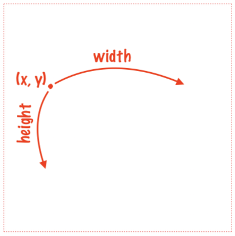
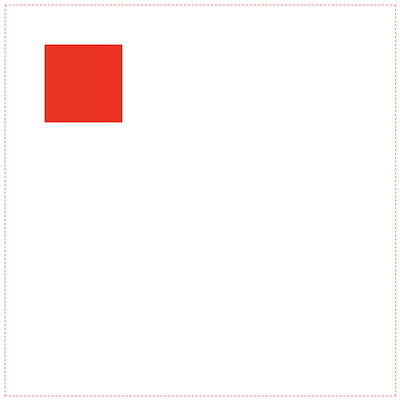

Hi everyone on our second lesson of the course "Canvas Basics Guide".

In [the previous part](/posts/canvas-basics-guide-lines), we've learned how to draw basic lines, and how to set styles for them. In that lesson we'll consider how to works with shapes.

For that part we'll use basic code from the first part as a template:

```html:title=index.html
<style media="screen">
  canvas {
    display: block;
    margin: 0 auto;
    border: 1px red dashed;
  }
</style>
<canvas id="canvas" height="500" width="500"></canvas>
<script src="./index.js"></script>
```

```js:title=index.js
const canvas = document.getElementById('canvas')
const ctx = canvas.getContext('2d')
```

## How to draw a rectangle

There are three methods that you can use for drawing a rectangle: ```fillRect```, ```strokeRect```, ```clearRect```. Each of them has the same parameters: ```x```, ```y```, ```width```, and ```height```. As you can guess, ```x``` and ```y``` determinate initial point, where we start working with our rectangle (top left corner) and ```width```, ```height``` describe sides of out rectangle (it makes able to automatically count the bottom right point):



Now, let's consider these methods more detailed.

### Canvas fillRect

You have to use the ```fillRect``` method when you want to fill your rectangle with some color.

```js:title=index.js
const canvas = document.getElementById('canvas')
const ctx = canvas.getContext('2d')

ctx.fillRect(50, 50, 100, 100)  // highlight-line
```

We'll get a solid filled rectangle in the left top angle of canvas:


If you want to change color, you have to set the ```fillStyle``` property:

```js:title=index.js
const canvas = document.getElementById('canvas')
const ctx = canvas.getContext('2d')

ctx.fillStyle = 'red' // highlight-line
ctx.fillRect(50, 50, 100, 100)
```

Now our rectangle becomes red:



### Canvas strokeRect

This method creates a stroke for your rectangle. Let's add a stroke for a new rectangle, that will surround the previous one:

```js:title=index.js
const canvas = document.getElementById('canvas')
const ctx = canvas.getContext('2d')

ctx.fillStyle = 'red'
ctx.fillRect(50, 50, 100, 100)

ctx.strokeStyle = 'blue'          // highlight-line
ctx.lineWidth = 5                 // highlight-line
ctx.strokeRect(25, 25, 150, 150)  // highlight-line
```

For changing stroke styles we used ```strokeStyle``` and ```lineWidth``` properties from the previous part:


### Canvas clearRect

This is a very important method, that clears ```canvas``` area. We'll use it when to consider basic animations in the next parts.

Now, let's clear some area of a rectangle:

```js:title=index.js
const canvas = document.getElementById('canvas')
const ctx = canvas.getContext('2d')

ctx.fillStyle = 'red'
ctx.fillRect(50, 50, 100, 100)

ctx.strokeStyle = 'blue'
ctx.lineWidth = 5
ctx.strokeRect(25, 25, 150, 150)
ctx.clearRect(100, 100, 150, 150)  // highlight-line
```

We'll get a little bit interesting pattern:


## How to draw arcs or circles

For drawing custom arcs and circles you have to use the arc method. It takes 5 parameters: ```x```, ```y``` (position of circle center), ```radius```, ```startAngle``` (angle, where we start drawing), ```endAngle``` (angle, where we end drawing).

Let's draw half of the circle in the center of canvas:

```js:title=index.js

const canvas = document.getElementById('canvas')
const ctx = canvas.getContext('2d')

ctx.fillStyle = 'red'
ctx.fillRect(50, 50, 100, 100)

ctx.strokeStyle = 'blue'
ctx.lineWidth = 5
ctx.strokeRect(25, 25, 150, 150)
ctx.clearRect(100, 100, 150, 150)

ctx.strokeStyle = 'green'  // highlight-line
ctx.arc(250, 250, 100, Math.PI , 2 * Math.PI)  // highlight-line
ctx.stroke()   // highlight-line
```

It looks like that:


And let's add some filled full circle inside this one:

```js:title=index.js
const canvas = document.getElementById('canvas')
const ctx = canvas.getContext('2d')

ctx.fillStyle = 'red'
ctx.fillRect(50, 50, 100, 100)

ctx.strokeStyle = 'blue'
ctx.lineWidth = 5
ctx.strokeRect(25, 25, 150, 150)
ctx.clearRect(100, 100, 150, 150)

ctx.strokeStyle = 'green'
ctx.arc(250, 250, 100, Math.PI, 2 * Math.PI)
ctx.stroke()

ctx.beginPath()    // highlight-line
ctx.strokeStyle = 'blue'  // highlight-line
ctx.fillStyle = 'blue'    // highlight-line
ctx.arc(250, 250, 50, 0, 2 * Math.PI)   // highlight-line
ctx.fill()  // highlight-line
```

The result:


We added ```beginPath``` to avoid filling the previous circle, and the ```fill``` method for filling the whole inner area in blue.

## How to draw a triangle

We have learned enough for drawing all basics shapes. How you any ideas about how to draw a triangle? We need just create a path of 3 point using lines and fill them (or add stroke):

```js:title=index.js
const canvas = document.getElementById('canvas')
const ctx = canvas.getContext('2d')

ctx.fillStyle = 'red'
ctx.fillRect(50, 50, 100, 100)

ctx.strokeStyle = 'blue'
ctx.lineWidth = 5
ctx.strokeRect(25, 25, 150, 150)
ctx.clearRect(100, 100, 150, 150)

ctx.strokeStyle = 'green'
ctx.arc(250, 250, 100, Math.PI, 2 * Math.PI)
ctx.stroke()

ctx.beginPath()
ctx.strokeStyle = 'blue'
ctx.fillStyle = 'blue'
ctx.arc(250, 250, 50, 0, 2 * Math.PI)
ctx.fill()

ctx.beginPath()          // highlight-line
ctx.moveTo(350, 350)     // highlight-line
ctx.lineTo(450, 350)     // highlight-line
ctx.lineTo(450, 450)     // highlight-line
ctx.lineTo(350, 350)     // highlight-line
ctx.fillStyle = 'orange' // highlight-line
ctx.fill()               // highlight-line
```

Expected output:


## Conclusions

So, we learned how to draw basic shapes: rectangles, circles and arcs, triangles, and any shape using lines, and methods ```fill```, ```stroke```. To avoid styles interacting you should reset the previous path using ```beginPath```. See you in [the next part](/posts/canvas-basics-guide-images) where we'll add images on our canvas.
