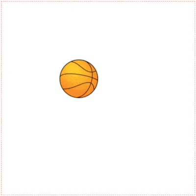
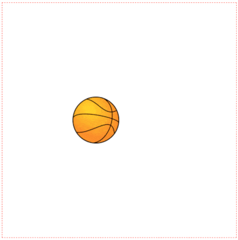
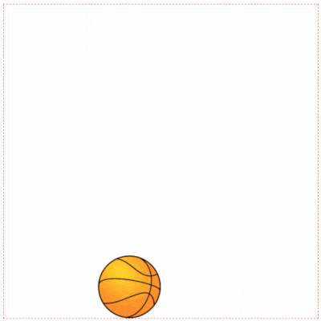
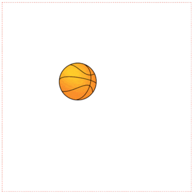
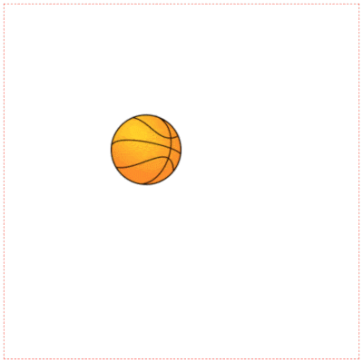

Hi everyone on our 4th lesson of the course "Canvas Basics Guide". Today we're going to add some animation on canvas using ```javascript```.  

## Intro

What do we know about animation? How does it work? Ok, basically it’s just order of images when every next image different from the previous. These images are changed with some frequency, so it creates some effect of moving. Also, we know about ```fps``` (frames per second) - it’s this frequency what we’re talking about. So, let’s create some animation on canvas.

## Draw an image

Firstly, we should output the image on the canvas. We learned how to do it in the previous lesson. Let's prepare our canvas and draw a ball, which we'll animate in the next steps:

```js:title=index.js
const canvas = document.getElementById('canvas')
const ctx = canvas.getContext('2d')

const cWidth = 500
const cHeight = 500

const bImg = new Image()
bImg.src = './ball.png'

const bWidth = 100
const bHeight = 100

bImg.onload = () => {
  ctx.drawImage(bImg, 150, 150, bWidth, bHeight)
}
```

We're getting:


## setInterval for animation

Now, we have to re-render a canvas with the new ball's position. Let's increase ```y``` position to simulate the falling effect, and call the drawing method with a new position:

```js:title=index.js
const canvas = document.getElementById('canvas')
const ctx = canvas.getContext('2d')

const cWidth = 500
const cHeight = 500

const bImg = new Image()
bImg.src = './ball.png'

const bWidth = 100
const bHeight = 100

bImg.onload = () => {
  ctx.drawImage(bImg, 150, 150, bWidth, bHeight)
}

const render = () => { // highlight-line
  currY += 10 // highlight-line
  ctx.drawImage(bImg, 150, currY, bWidth, bHeight) // highlight-line
} // highlight-line

const delay = 16 // highlight-line
setInterval(render, delay) // highlight-line
```

Well, is it what you've expected?



Ok, don't worry, you just have to clear canvas each time before repainting, so after some fixes:

```js:title=index.js
const canvas = document.getElementById('canvas')
const ctx = canvas.getContext('2d')

const cWidth = 500
const cHeight = 500

const bImg = new Image()
bImg.src = './ball.png'

const bWidth = 100
const bHeight = 100

bImg.onload = () => {
  ctx.drawImage(bImg, 150, 150, bWidth, bHeight)
}

const render = () => {
  ctx.clearRect(0, 0, cWidth, cHeight)
  currY += 10
  ctx.drawImage(bImg, 150, currY, bWidth, bHeight)
}

const delay = 16
setInterval(render, delay)
```

We're getting basic animation:



But, why our ball falling through the bottom, let's fix that by adding speed variable and checking current position:

```js:title=index.js
const canvas = document.getElementById('canvas')
const ctx = canvas.getContext('2d')

const cWidth = 500
const cHeight = 500

const bImg = new Image()
bImg.src = './ball.png'

const bWidth = 100
const bHeight = 100

bImg.onload = () => {
  ctx.drawImage(bImg, 150, 150, bWidth, bHeight)
}

// initial speed
let bSpeed = 10 // highlight-line

const MAX_BOTTOM_POS = cHeight - bHeight // highlight-line

const render = () => {
  ctx.clearRect(0, 0, cWidth, cHeight)
  currY += bSpeed
  if (currY >= MAX_BOTTOM_POS) { // highlight-line
    currY = MAX_BOTTOM_POS // highlight-line
    bSpeed = 0 // highlight-line
  } // highlight-line
  ctx.drawImage(bImg, 150, currY, bWidth, bHeight)
}

const delay = 16
setInterval(render, delay)
```

So, now the ball stops at the bottom:



## Playing around

But it's not the end, by adding some magic (physics), we can get a realistic ball with acceleration and reflection from the bottom. We'll skip all theory to simplify this tutorial (it's not our main topic), but this easier than you could guess:

```js:title=index.js
const canvas = document.getElementById('canvas')
const ctx = canvas.getContext('2d')

const cWidth = 500
const cHeight = 500

const bImg = new Image()
bImg.src = './ball.png'

const bWidth = 100
const bHeight = 100

bImg.onload = () => {
  ctx.drawImage(bImg, 150, 150, bWidth, bHeight)
}

let currX = 150
let currY = 150

// initial speed
let bSpeed = 0

// acceleration
let a = 1 // highlight-line
let initialSpeed = 0 // highlight-line
// time
let time = 0 // highlight-line

// direction down
let d = -1 // highlight-line

const MIN_TOP_POS = 150 // highlight-line
const MAX_BOTTOM_POS = cHeight - bHeight

const render = () => {
  ctx.clearRect(0, 0, cWidth, cHeight)
  time += delay // highlight-line
  bSpeed = initialSpeed + d * a * (time / 1000) // highlight-line
  const shift = d * bSpeed * delay // highlight-line
  currY += shift // highlight-line

  // bottom
  if (currY >= MAX_BOTTOM_POS) { // highlight-line
    currY = MAX_BOTTOM_POS - shift // highlight-line
    d = 1 // highlight-line
    initialSpeed = bSpeed // highlight-line
    time = 0 // highlight-line
  } else if (currY <= MIN_TOP_POS) { // highlight-line
    currY = MIN_TOP_POS // highlight-line
    d = -1 // highlight-line
    initialSpeed = 0 // highlight-line
    time = 0 // highlight-line
  } // highlight-line
  
  ctx.drawImage(bImg, 150, currY, bWidth, bHeight)
}

const delay = 16
setInterval(render, delay)
```

Realistic falling (with acceleration):



## Extra work: How to rotate the image on the canvas

What about rotation? It's can be not so clear. Indeed For rotation image on the canvas, you should rotate your canvas by setting context point (o, o) to the ball's center and rotation canvas by this point, after that we have to draw image using new coordinates (as well as your context point will be at ball center for drawing the ball you have to shift ```x```, ```y``` by left and top on half of the ball). Before and after that we'll use ```save``` and ```restore``` methods for returning context in the normal mode (to set context point at (0, 0)):

```js:title=index.js
const canvas = document.getElementById('canvas')
const ctx = canvas.getContext('2d')

const cWidth = 500
const cHeight = 500

const bImg = new Image()
bImg.src = './ball.png'

const bWidth = 100
const bHeight = 100

bImg.onload = () => {
  ctx.drawImage(bImg, 150, 150, bWidth, bHeight)
}

let currX = 150
let currY = 150

// initial speed
let bSpeed = 0
let rotationSpeed = 0.3 // highlight-line
let rotationDegs = 0 // highlight-line

// acceleration
let a = 1
let initialSpeed = 0
// time
let time = 0

// direction down
let d = -1

const MIN_TOP_POS = 150
const MAX_BOTTOM_POS = cHeight - bHeight

const render = () => {
  ctx.clearRect(0, 0, cWidth, cHeight)
  time += delay
  bSpeed = initialSpeed + d * a * (time / 1000)
  const shift = d * bSpeed * delay
  currY += shift

  rotationDegs += shift * rotationSpeed // highlight-line
  // bottom
  if (currY >= MAX_BOTTOM_POS) {
    currY = MAX_BOTTOM_POS - shift
    d = 1
    initialSpeed = bSpeed
    time = 0
  } else if (currY <= MIN_TOP_POS) {
    currY = MIN_TOP_POS
    d = -1
    initialSpeed = 0
    time = 0
  }
  
  ctx.save() // highlight-line
  // move to the center of the ball
  ctx.translate(currX + bWidth / 2, currY + bHeight / 2) // highlight-line
  // rotate the canvas to the specified degrees
  ctx.rotate(rotationDegs * Math.PI / 180) // highlight-line
  // since the context is rotated, the image will be rotated also
  ctx.drawImage(bImg, -bWidth / 2, -bHeight / 2, bWidth, bHeight) // highlight-line
  ctx.restore() // highlight-line
}

const delay = 16
setInterval(render, delay)
```

Falling with rotation:



## Conclusions

We've learned how to animate objects on the canvas.
See you in the next lesson, where we'll consider advanced animation (requestAnimationFrame vs setInterval, sprite animation).
