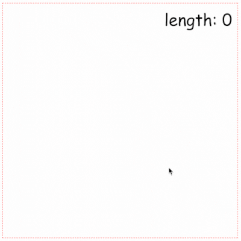

You’re welcome to the second part of our tutorial “Snake” game in JavaScript. We're stopped on adding keyboard control for the game. (You can find the previous part [here](/posts/snake-game-in-js-1)). And now we can control our snake like that:


As you can notice, we have a problem with increasing the snake's length without any causes. Let's start from fixing that.

## Length control

On the previous lesson, we designed our ```Snake``` class, it consists of a few methods:

```js:title=src/index.js
class Snake {
  constructor() {}
  // drawing snake on the canvas
  draw() {}
  // snake's moving
  running() {}

  // snake's control using keyboard
  directionControl() {}

  // control snake's growing
  snakeLengthControl() {}

  // checking intersections with map boards
  validationCoordinates() {}

  // checking inner collision of snake's head with body
  findSnakeСollision() {}
}
```

We have implemented the ```constructor```, ```draw```,
```running```, ```directionControl``` methods already. It's time for ```snakeLengthControl```. For that purpose we have to back to our our painting method:

```js:title=src/index.js
draw() {
  this.ctx.beginPath()
  this.ctx.fillStyle = Snake.COLOR
  this.ctx.arc(this.x, this.y, Snake.HEAD_RADIUS, 0, 2 * Math.PI)
  this.ctx.fill()
  this.ctx.closePath()
}
```

On each iteration, we just paint a new position of snake’s head without any clearing a canvas. (If you have been worked with ```canvas animation``` before you probably cleared canvas before each rerender, but we don’t do it for simplicity and performance purposes). The sense is that the previous snake's position stays on the previous position and if we render just a new position we'll have an effect of snake's moving without entire rerendering.

But it doesn’t solve the problem with length increasing. Any ideas? Yeap, we should clearing point in the tail each time when we add a new point in the head. It’s very effective solution for that game. But we don’t have any information about previous positions. Let’s start keeping them into some ```array```. For that we'll create method ```pushCoordinates```:

```js:title=src/index.js
pushCoordinates() {
  this.coordinates.push({
    x: this.x,
    y: this.y,
  })
}
```

As we said we have to call this method after any changes of snake’s position. So it’s time to update ```running``` method:

```js:title=src/index.js
running() {
  const radian = degToRad(this.angle)
  this.x += Snake.SPEED * Math.cos(radian)
  this.y += Snake.SPEED * Math.sin(radian)
  
  this.pushCoordinates() // highlight-line
  this.draw()
}
```

Well, when we have a previous position we can return to implementation ```snakeLengthControl```. Out array of ```coordinates``` works like a ```queue```. We place new elements at the end of the array. And when points amount increases we’ll take the first point (which was added at the far time), clear map, and delete it from an array.

Let's look at function:

```js:title=src/index.js
snakeLengthControl() {
  if (this.coordinates.length > this.length) {
    const { x, y } = this.coordinates[0]
    this.ctx.beginPath()
    this.ctx.fillStyle = '#fff'
    this.ctx.arc(x, y, Snake.HEAD_RADIUS + 2, 0, 2 * Math.PI)
    this.ctx.fill()
    this.ctx.closePath()
    this.coordinates.shift()
  }
}
```

To test our new method we have to add it calling, and it’ll be fine if we add it into ```pushCoordinates```:

```js:title=src/index.js
pushCoordinates() {
  this.coordinates.push({
    x: this.x,
    y: this.y,
  })
  this.snakeLengthControl() // highlight-line
}
```

Now, it looks better:



We have implemented enough methods to make the game realistic. But what next? Foods... It’s really very simple. Each object have just two scenarios: drawing at generation and destroying at collision with snake.

So, our ```Food``` class will be like that:

```js:title=src/index.js
class Food {
  constructor(x, y, color, ctx) {
    this.x = x
    this.y = y
    this.color = color
    this.draw(ctx)
  }

  draw(ctx) {
    ctx.beginPath()
    ctx.fillStyle = this.color
    ctx.arc(this.x, this.y, Food.RADIUS, 0, 2 * Math.PI)
    ctx.fill()
    ctx.closePath()
  }

  destroy(ctx) {
    ctx.beginPath()
    ctx.fillStyle = '#fff'
    ctx.strokeStyle = '#fff'
    ctx.arc(this.x, this.y, Food.RADIUS, 0, 2 * Math.PI)
    ctx.fill()
    ctx.stroke()
    ctx.closePath()
  }
}
Food.RADIUS = 6
```

Now we have to create food’s generation method. It just a function that has a minimal number of food objects and creates a new random object when the current number is less:

```js:title=src/index.js
const maxAmountOfFood = 20
const foodGeneration = (foods = [], ctx) => {
  let diff = maxAmountOfFood - foods.length
  while (diff > 0) {
    const x = Math.round(Math.random() * 500)
    const y = Math.round(Math.random() * 500)
    const color = '#'+((1 << 24) * Math.random()|0).toString(16)
    const food = new Food(x, y, color, ctx)
    foods.push(food)
    diff--
  }
}
```

To test how it works we have to call this function. In optimization purpose we can place the initial call into the ```startGame``` function:

```js:title=src/index.js
const startGame = (game, ctx) => {
  const { snake } = game
  foodGeneration(foods, ctx) // highlight-line
  game.snakeInterval = setInterval(snake.running.bind(snake), 30)
  addEventListener('keydown', snake.directionControl.bind(snake)) 
}
```

Now our canvas renders with foods points:


But you can notice that the snake doesn’t react on collisions with these points. On each collision, our snake should increase in length and the point should be cleared. Out collisions function will contain a ```loop``` with each food point and we’ll just check intersection of point and snake’s head. On each intersection we’ll call ```destroy``` method for food point:

```js:title=src/index.js
const findFoodCollision = (foods, ctx, snake) => {
  for (const food of foods) {
    if (
      (snake.x > food.x - 10) && (snake.x < food.x + 10) &&
      (snake.y > food.y - 10) && (snake.y < food.y + 10)
    ) {
      food.destroy(ctx)
      foods.splice(foods.indexOf(food), 1)
      snake.length += 1
    }
  }
}
```

And for calling this method we should create a new interval in ```startGame``` function:

```js:title=src/index.js
const startGame = (game, ctx) => {
  const { snake, foods } = game
  foodGeneration(foods, ctx)

  game.snakeInterval = setInterval(snake.running.bind(snake), 30)
  game.foodInterval = setInterval(findFoodCollision, 30, foods, snake, ctx) // highlight-line

  addEventListener('keydown', snake.directionControl.bind(snake))
}
```

And don't forget to add initial value of foods array in the initial game object:

```js:title=src/index.js
window.onload = () => {
  const canvas = document.getElementById('map')
  const ctx = canvas.getContext('2d')

  const snake = new Snake(100, 100, 0, Snake.INITIAL_LENGTH, ctx)
  const game = {
    snake,
    foods: [], // highlight-line
  }

  startGame(game, ctx)
}
```

So, it definitely looks better:


Did you notice the score block, with containing current snake’s length? Let’s connect it with real length. We’ll use the ```changeScore``` function for updating the ```DOM``` element value:

```js:title=src/index.js
const changeScore = (score) => {
  const scoreElem = document.getElementById('score')
  scoreElem.innerHTML = `length: ${score}`
}
```

And we should modify ```findFoodCollision``` function for calling ```changeScore```:

```js:title=src/index.js
const findFoodCollision = (foods, snake, ctx) => {
  for (const food of foods) {
    if (
      (snake.x > food.x - 10) && (snake.x < food.x + 10) &&
      (snake.y > food.y - 10) && (snake.y < food.y + 10)
    ) {
      food.destroy(ctx)
      foods.splice(foods.indexOf(food), 1)
      snake.length += 1
      changeScore(snake.length - Snake.INITIAL_LENGTH) // highlight-line
    }
  }
}
```

In the result, we're getting:


Also, you can test it [here](/examples/snake-game-in-js) (DEMO).

## Homework:

There are a few methods, that you should try to implement by yourself:

* snake collisions (snake's head with the body)
* finish game function
* adding foods after removing old food

Also, you can go further and change some advanced details:

* use ```requestAnimationFrame``` instead of ```setInterval```
* food generation without intersections with existent objects
* etc

Anyway, you can find a full game at GitHub or on YouTube. Links placed below.

## Links:

* [YouTube](https://www.youtube.com/watch?v=dguyPUlglAg)
* [GitHub](https://github.com/amadevBox/snake)

Thanks for reading. If you have a question feel free to leave them here.
