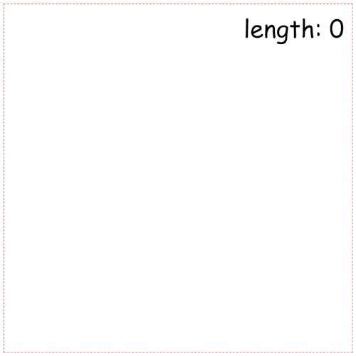

Hi everyone and welcome to the first tutorial at my blog! I'm amadev, and this info should be enough for your at this time. You might saw me at YouTube, so don't wonder. Yeap, it's me. Let's better to write some code. 😀

## Intro & preconditions

As you can notice we're going to create Snake game. We'll use no frameworks and game engines for this. Just using plain ```javascript``` we'll step by step create something like [this](/examples/snake-game-in-js).

## Place where all starts

Let's create first file for our tiny project - ```index.html```. After that we create ```javascript``` file and connect it with ```index.html```

```html:title=index.html
<body>
  <script src="src/index.js"></script>
</body>
```

For painting out game on the screen we'll use ```canvas```. Also let's add element for score (snake length) and some styles:

```html:title=index.html
<body>
  <script src="src/index.js"></script>
  <style media="screen">
    #map {
      display: block;
      margin: 0 auto;
      border: 1px dashed red;
    }

    .wrapper {
      position: relative;
      width: 500px;
      height: 500px;
      margin: 0 auto;
    }

    #score {
      position: absolute;
      right: 0;
      top: 0;
      margin: 10px;
      font: 35px Comic Sans MS;
    }
  </style>
  <div class="wrapper">
    <p id="score">length: 0</p>
    <canvas id="map" width="500" height="500"></canvas>
  </div>
</body>
```

All that we have it's:


## Time for javascript

Now, it's time for our ```index.js``` from previous step. We should catch the moment of rendering ```DOM``` elements. Do you know how get it? One of the ways - ```window.onload``` method. Let's use it for getting access to the ```DOM``` elements and starting our game loop.

```js:title=src/index.js
window.onload = () => {
  const canvas = document.getElementById('map')
  const ctx = canvas.getContext('2d')
  
  startGame()
}
```

After that we can go to implementation of ```startGame``` function. We need some abstraction to collect all info about game state. As it's javascript - what can be better than object?).

```js:title=src/index.js
const game = {}

startGame(game)
```

But what info we shoude keep there? We have at least 2 types of game objects: snake and foods. So we shoud implement them and place into object ```game```.

Let's start from ```class``` Snake and defining methods for it. At the start, it'll be look like this:

```js:title=src/index.js
class Snake {
  constructor() {}
  // drawing snake on the canvas
  draw() {}
  // move snake
  running() {}

  // control snake using keyboard
  directionControl() {}

  // controll snakes grows
  snakeLengthControl() {}

  // check intersections with map boards
  validationCoordinates() {}

  // check inner collision of snake head with body
  findSnakeСollision() {}
}
```

Now we can describe them more details
At first we should decide what data we need to out snake, we'll pass that data into ```constructor```. For determination snake head position we can use just ```x```, ```y``` and ```coordinates``` array for storing previous position. Also we need know the snake ```lenght```, direction (```angle```), ```color```, canvas context that connected to snake (```ctx```).

After that we get constructor:

```js:title=src/index.js
constructor(x, y, angle, length, ctx) {
  this.x = x
  this.y = y
  this.angle = angle
  this.length = length
  this.ctx = ctx
  this.coordinates = []
}
```

But also we have some common characteristic, that we can separate as static properties:

```js:title=src/index.js
Snake.COLOR = '#ff5050'
Snake.INITIAL_LENGTH = 150
Snake.HEAD_RADIUS = 5
Snake.SPEED = 2 // points per iteration
Snake.ROTATION_SPEED = 5 // degrees per iteration
```

Well, now let's consider draw method. We can implement that using canvas draw methods. We should just draw circles of some radius and some color witch we keep in our object.

So, it'll be look like that:

```js:title=src/index.js
draw() {
  this.ctx.beginPath()
  this.ctx.fillStyle = Snake.COLOR
  this.ctx.arc(this.x, this.y, Snake.HEAD_RADIUS, 0, 2 * Math.PI)
  this.ctx.fill()
  this.ctx.closePath()
}
```

But all that we have for now - it's just object that can paint static point on the canvas. As you can geus we're going to implement ```running``` method. The logic of running is simple. On each iteration we shoud change head position using speed.

```js:title=src/index.js
running() {
  this.x += Snake.SPEED
  this.y += Snake.SPEED
}
```

Ok, to test our ```running``` we should return to ```startGame``` function and implement game loop.
We stoped on ```game``` object, that collect all data about our game objects and parametrs. Now we can pass to ```game``` first of them - instanse of ```Snake``` class:

```js:title=src/index.js
window.onload = () => {
  const canvas = document.getElementById('map')
  const ctx = canvas.getContext('2d')
  
 const snake = new Snake(100, 100, 0, Snake.INITIAL_LENGTH, ctx)  // highlight-line
  const game = {             // highlight-line
    snake,                   // highlight-line
  }                          // highlight-line
  
  startGame(game)            // highlight-line
}
```

So, now we have access to snake inside ```startGame```. To implement game loop we need call ```running``` with some freaquency. There are a few ways to do that, but we'll choose the easier - ```setInterval```.
After that our function will be like that:

```js:title=src/index.js
const startGame = (game) => {
  const { snake } = game
  
  game.snakeInterval = setInterval(snake.running, 30)
}
```

But, if you launch this code, you'll get error (```Uncaught TypeError: Cannot read property 'angle' of undefined
at running```) inside ```running``` method, because setInterval lose context and ```running``` methon doesn't know anything about snake, to solve that we should bind context to method:

```js:title=src/index.js
const startGame = (game) => {
  const { snake } = game
  
  game.snakeInterval = setInterval(snake.running.bind(snake), 30) // highlight-line
}
```

Your ```canvas``` still empty? We're changing position on each iteration of ```setInterval```, but we don't call ```draw``` method to repainting our canvas, so some changes:

```js:title=src/index.js
running() {
  this.x += Snake.SPEED
  this.y += Snake.SPEED

  this.draw() // highlight-line
}
```

And our canvas aliving:



Ok, moving forvard and consider our control function. Our snake will turn due to keys events.
Press on left arrow will turn snake to left and on right to right. So we need connect ```directionControl``` method with event listener. There no better place for that then ```startGame``` function. We can use ```eventListener``` on whole ```document``` object:


```js:title=src/index.js
const startGame = (game) => {
  const { snake } = game
  
  game.snakeInterval = setInterval(snake.running, 30)
 
  addEventListener('keydown', snake.directionControl) // highlight-line
}
```

Perfect, now ```directionControl``` will called each time, when you press on some key. And our method will get all information about that event via parametr. So, it's time to handle that. We have a simple condition, if ```keyCode``` of pressed key is ```37``` we'll call ```turnLeft``` method, that decrease snake ```angle```, and oposite way if keyCode is ```39```:


```js:title=src/index.js
directionControl(e) {
  switch(e.keyCode) {
    case 37: {
      this.turnLeft()
      break
    }
    case 39: {
      this.turnRight()
      break
    }
  }
}

turnLeft() {
  this.angle -= Snake.ROTATION_SPEED
}

turnRight() {
  this.angle += Snake.ROTATION_SPEED
}
```

However, we don't use ```angle``` value. Where we should place it? Yep, into ```running```.
At this moment our ```running``` method just 
increase value of ```x``` and ```y````. Instead of that for getting coordinates (```x```, ```y```) changes we must count proection of speed on angle. For ```x``` it's ```speed * Math.cos(angle)``` and for ```y```, as you can gues, ```speed * Math.sin(speed)```.

As you can notice we keep our direction in degrees, but for counting direction we must convert them into radians:

```js:title=src/index.js
const degToRad = (angle) => ((angle * Math.PI) / 180)
```

After that, we'll get:

```js:title=src/index.js
running() {
  const radian = degToRad(this.angle)        // highlight-line
  this.x += Snake.SPEED * Math.cos(radian)   // highlight-line
  this.y += Snake.SPEED * Math.sin(radian)   // highlight-line

  this.draw()
}
```

Let's check our control. Did you also get an error?
Actualy, it's the same problem with losing context for ```directionControl``` as we had for ```running``` inside ```setInterval```. Let's bind our snake to ```directionControl```.

After fixing, we'll get:

```js:title=src/index.js
const startGame = (game) => {
  const { snake } = game
  
  game.snakeInterval = setInterval(snake.running.bind(snake), 30)
 
  addEventListener('keydown', snake.directionControl.bind(snake)) // highlight-line
}
```
